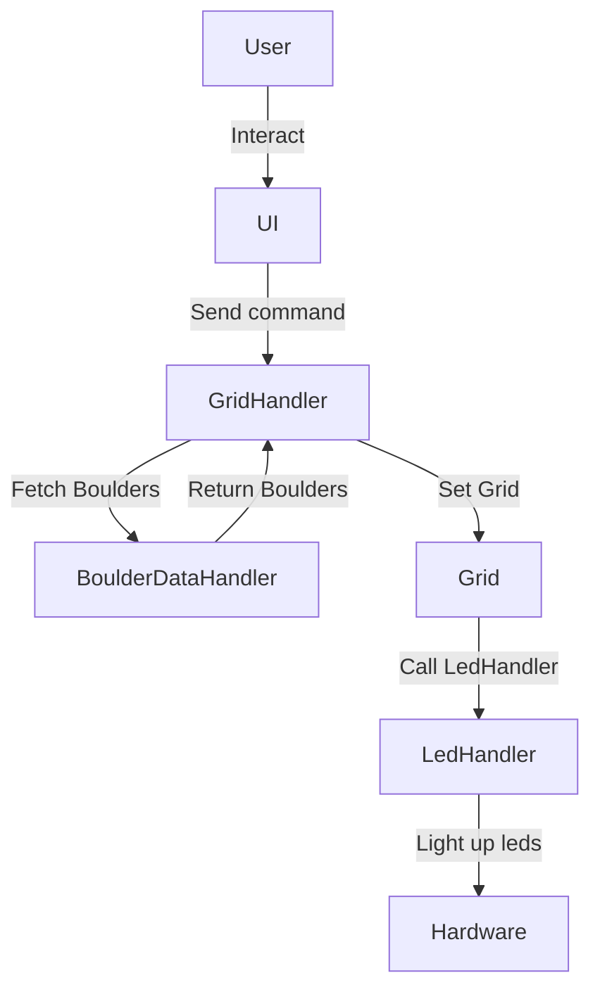

# ElectricClimbingWall 

## Description:
Goal is to build:

Software for Moonboard style, led powered, electric climbing wall. 

Leds are light up to visualize boulders on a climbing wall. 

User can set, browse and light up boulders from a GUI.

## Architecture: 

### Ui 
- Handles user interaction.
- Sends commands to [GridHandler](GridHandler.py).

### [GridHandler](GridHandler.py)
- Handles the communication between Ui, [Grid](Grid) and [BoulderDataHandler](BoulderDataHandler.py).
- Fetches boulders from [BoulderDataHandler](BoulderDataHandler.py).
- Sets the state of the [Grid](Grid.py).

### [BoulderDataHandler](BoulderDataHandler.py)
- Serializes and loads boulders from/to file.

### [Grid](Grid.py)
- Defines the state of the board -> which leds are light up.
- Sends state to [LedHandler](LedHandler.py), which is the lowest level class communicating with leds.

### [LedHandler](LedHandler.py)
- Sets the led-lights. 
- Called by [Grid](Grid).

