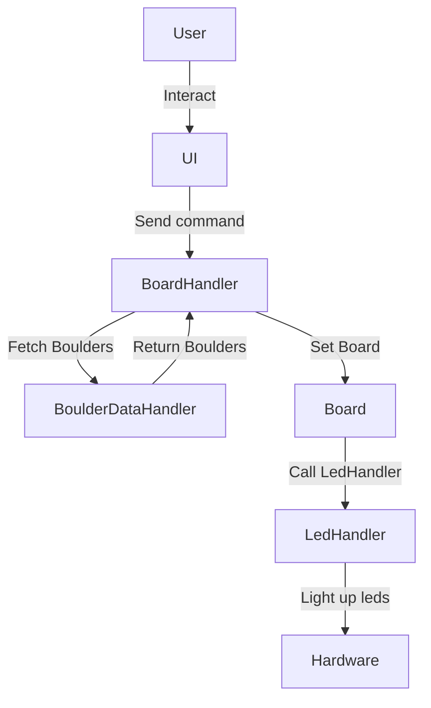

# ElectricClimbingWall 

## Description:
Goal is to build:

Software for Moonboard style, led powered, electric climbing wall. 

Leds are light up to visualize boulders on a climbing wall. 

User can set, browse and light up boulders from a GUI.

## Architecture: 

### [Ui](Ui.py) 
- Handles user interaction.
- Sends commands to [BoardHandler](BoardHandler.py).
- Built with [Kivy](https://kivy.org/#home)

### [BoardHandler](BoardHandler.py)
- Handles the communication between [Ui](Ui.py), [Board](Board) and [BoulderDataHandler](BoulderDataHandler.py).
- Fetches boulders from [BoulderDataHandler](BoulderDataHandler.py).
- Sets the state of the [Board](Board.py).

### [BoulderDataHandler](BoulderDataHandler.py)
- Serializes and loads boulders from/to file.
- Uses [Pickle](https://docs.python.org/3/library/pickle.html) 

### [Board](Board.py)
- Defines the state of the board -> which leds are light up.
- Sends state to [LedHandler](LedHandler.py), which is the lowest level class communicating with leds.

### [LedHandler](LedHandler.py)
- Sets the led-lights. 
- Called by [Board](Board).

## Dependencies: 

### Ui:
- [Kivy](https://kivy.org/#home)

### Serialization:
- [Pickle](https://docs.python.org/3/library/pickle.html)  
